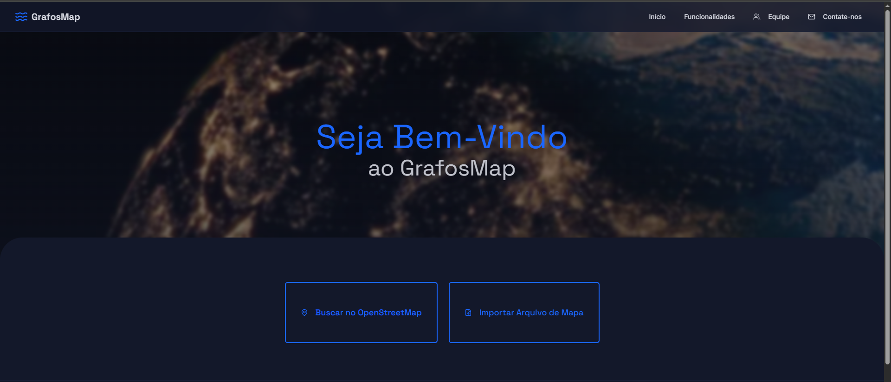
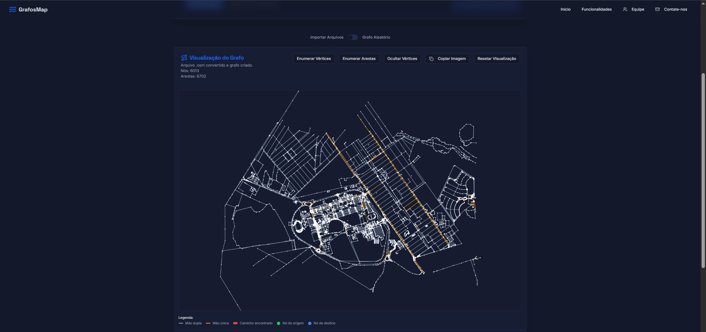
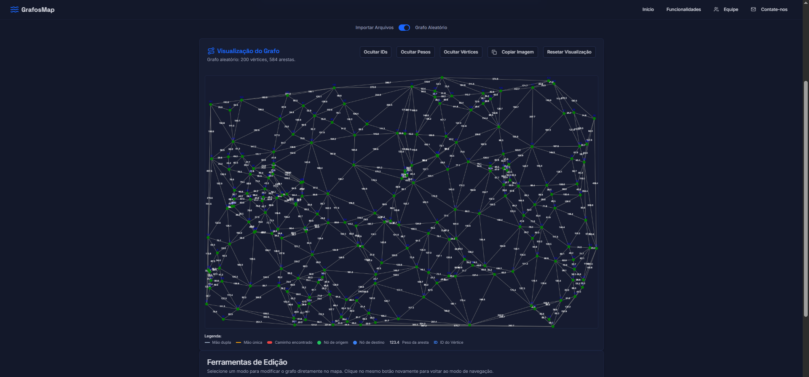

# 🗺️ Visualizador de Grafos com Algoritmo de Dijkstra

Uma aplicação web para visualização e análise de grafos, implementando o algoritmo de Dijkstra para encontrar o menor caminho entre vértices. Desenvolvida com Next.js e TypeScript, oferece uma interface intuitiva para carregar, visualizar e editar grafos de diferentes tipos.

## ✨ Funcionalidades

- **📁 Carregamento de Arquivos**: Suporte para arquivos .OSM e .POLY
- **🎲 Grafos Aleatórios**: Geração automática de vértices e triangulação de Delaunay
- **🔍 Algoritmo de Dijkstra**: Implementação otimizada com MinHeap
- **🎨 Visualização Interativa**: Zoom e navegação estilo Google Maps
- **✏️ Ferramentas de Edição**: Adicionar/remover vértices e arestas
- **📊 Estatísticas**: Contadores de vértices, arestas e métricas de performance
- **🌙 Tema Escuro/Claro**: Interface adaptável
- **📱 Responsivo**: Funciona em desktop e dispositivos móveis

## 🛠️ Ferramentas Utilizadas


### Tecnologias Adicionais
- **D3.js** - Biblioteca para triangulação de Delaunay
- **Canvas** - Renderização gráfica

## 🚀 Como Executar

### Pré-requisitos

- Node.js (versão 18 ou superior)
- NPM ou Yarn

### Instalação

1. **Clone o repositório**
   ```bash
   git clone https://github.com/omaraljawabri/GrafoMap.git
   cd trabalho-final-aed2
   ```

2. **Instale as dependências**
   ```bash
   npm install
   # ou
   yarn install
   ```

3. **Execute em modo de desenvolvimento**
   ```bash
   npm run dev
   # ou
   yarn dev
   ```

4. **Acesse a aplicação**
   ```
   http://localhost:3000
   ```

### Scripts Disponíveis

```bash
npm run dev          # Executa em modo desenvolvimento
npm run build        # Gera build de produção
npm run start        # Executa build de produção
npm run lint         # Executa linter
```

## 📸 Screenshots

### Carrossel de Imagens

<div align="center">
  
  <p><em>Interface principal com grafo carregado</em></p>
</div>

<div align="center">
  
  <p><em>Visualização do Mapa em Grafo</em></p>
</div>

<div align="center">
  
  <p><em>Geração de grafo aleatório com triangulação</em></p>
</div>

## 📁 Estrutura do Projeto

```
trabalho-final-aed2/
├── src/
│   ├── app/
│   │   ├── _components/          # Componentes 
│   │   │   ├── ui/              # Componentes de interface
│   │   │   │   ├── button.tsx
│   │   │   │   ├── card.tsx
│   │   │   │   ├── dialog.tsx
│   │   │   │   └── ...
│   │   │   ├── header.tsx       # Cabeçalho da aplicação
│   │   │   ├── footer.tsx       # Rodapé da aplicação
│   │   │   └── ...
│   │   ├── _hooks/              # Hooks customizados
│   │   │   ├── use-mobile.ts
│   │   │   └── use-toast.ts
│   │   ├── (home)/              # Página inicial
│   │   │   └── page.tsx
│   │   ├── dijkstra-map/        # Página principal do Djikstra
│   │   │   └── page.tsx
│   │   ├── globals.css          # Estilos globais
│   │   ├── layout.tsx           # Layout principal
│   │   └── ...
│   └── lib/                     # Utilitários e configurações
│       └── utils.ts
├── screenshots/                 # Screenshots da aplicação
├── package.json                 # Dependências e scripts
├── tailwind.config.ts          # Configuração do Tailwind
├── tsconfig.json               # Configuração do TypeScript
└── README.md                   # Este arquivo
```

## 🎯 Funcionalidades Detalhadas

### Carregamento de Arquivos
- **Arquivos .OSM**: Importação de dados do OpenStreetMap
- **Arquivos .POLY**: Suporte para formatos .poly

### Visualização Interativa
- **Zoom**: Roda do mouse e duplo clique
- **Arraste**: Arrastar para navegar
- **Resetar**: Botão para retornar à visualização original
- **Enumeração**: Exibição de IDs de vértices e pesos de arestas

### Algoritmo de Dijkstra
- **Implementação Otimizada**: Usando MinHeap para performance
- **Métricas**: Tempo de processamento e nós visitados
- **Resultados Detalhados**: Distância, caminho e estatísticas

### Ferramentas de Edição
- **Adicionar Vértice**: Clique em local vazio
- **Remover Vértice**: Clique no vértice
- **Adicionar Aresta**: Clique em dois vértices
- **Remover Aresta**: Clique nos vértices da aresta

## 🤝 Contribuição

1. Faça um fork do projeto
2. Crie uma branch para sua feature (`git checkout -b feature/Feature`)
3. Commit suas mudanças (`git commit -m 'Add some Feature'`)
4. Push para a branch (`git push origin feature/Feature`)
5. Abra um Pull Request

## 📝 Licença

Este projeto está sob a licença MIT. Veja o arquivo [LICENSE](LICENSE) para mais detalhes.

## 👨‍💻 Equipe

**Pedro**
- GitHub: [@pedroaugustorodrigues](https://github.com/pedroaugustorodrigues)
- Email:  pedroaugusto23@discente.ufg.br

**Stephano Viglio**
- GitHub: [@StephanoViglio](https://github.com/StephanoViglio)
- Email: stephanoviglio@discente.ufg.br

**Omar Al Jawabri**
- GitHub: [@omaraljawabri](https://github.com/omaraljawabri)
- Email: omar.jawabri@discente.ufg.br

**Hugo Borges**
- GitHub: [@HugoPBorges](https://github.com/HugoPBorges
- Email: hugoborges@discente.ufg.br

**Rodrigo Luiz**
- GitHub: [@rodrigoluizf](https://github.com/rodrigoluizf)
- Email: rodrigoluiz@discente.ufg.br

## 🙏 Agradecimentos

- Professor Andre Luiz Moura e colegas do curso de Engenharia de Software

---

<div align="center">
  <p>Feito com ❤️ para o trabalho final de AED2</p>
</div> 
